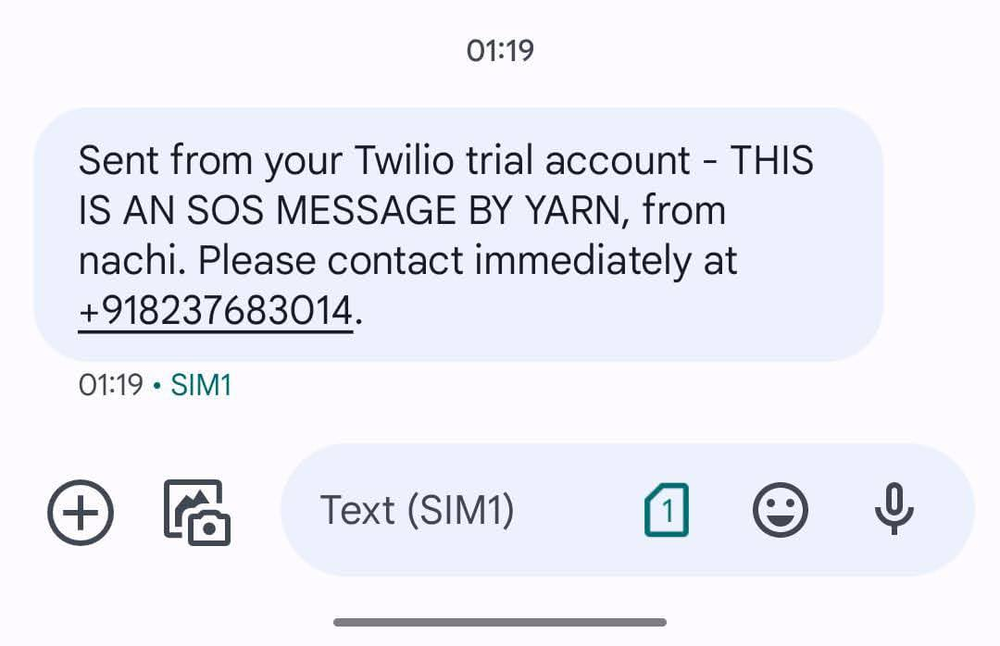

# YARN: Where concerns Unwind, Wellness binds

## Deployed website link: https://yarn-1.onrender.com
YARN is an innovative application designed to address the challenges faced by individuals living with Alzheimer's disease. By providing a range of features aimed at cognitive support, task management, emergency assistance, and improving overall quality of life, YARN aims to make a meaningful difference in the lives of both patients and caregivers.

## Video
https://github.com/Nachi28/YARN/assets/79222622/f0ba2b9b-83b0-4e4b-b960-765f9f7b3fff

## The problem YARN solves

Alzheimer's disease poses significant challenges for both individuals living with the condition and their caregivers. YARN addresses some of the key problems associated with Alzheimer's:

- **Cognitive Support**: YARN offers memory-enhancing games and cognitive assessment tools to help individuals maintain cognitive function and track changes over time.
- **Daily Task Management**: The app provides personalized reminders for daily activities and medication management features to assist Alzheimer's patients in managing their daily tasks and appointments.
- **Emergency Assistance**: YARN features an SOS function for swift help in crises, providing peace of mind to both patients and caregivers.
- **Improved Quality of Life**: By addressing these challenges, YARN aims to enhance cognitive abilities, foster independence, reduce social isolation, and ultimately improve the overall quality of life for individuals living with Alzheimer's and their caregivers.

## What People Can Use it For

- **Memory Enhancement**: Engage in memory-enhancing games to exercise cognitive abilities and potentially slow down cognitive decline.
- **Task Management**: Manage daily tasks and appointments through personalized reminders and a calendar feature.
- **Social Connection**: Participate in the community forum to connect with others facing similar challenges, share experiences, and provide support to each other.
- **Emergency Assistance**: Seek assistance quickly in case of emergencies using the SOS feature.
- **Medication Management**: Effectively manage medications, reducing the risk of missed doses and complications.

## Photos

### Block Diagram


### SOS Message



## Getting Started

To get started with YARN, follow these steps:

1. Clone the repository:

```bash
git clone https://github.com/Nachi28/YARN.git
```
2. Ensure you have the latest version of Node.js installed.

3. Install all required packages:
```bash
npm install
```
4. Set up your environment variables in a file named .env with the following format:
```bash
TWILIO_ACCOUNT_SID=xxx-xxx
TWILIO_AUTH_TOKEN=xxx-xxx
SESSION_SECRET=xxx-xxx
MONGODB_URI=xxx-xxx
OPENAI=xxx-xxx
```
Make sure to replace xxx-xxx with your actual credentials.

5. Run the application:
```bash
npm run devStart
```
6. Finally, open your web browser and navigate to http://localhost:5000 to access the application.

